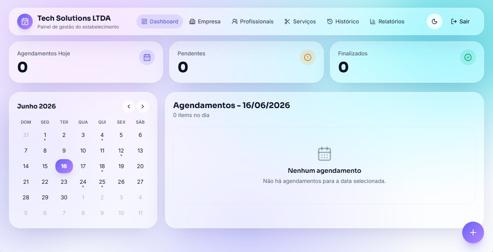
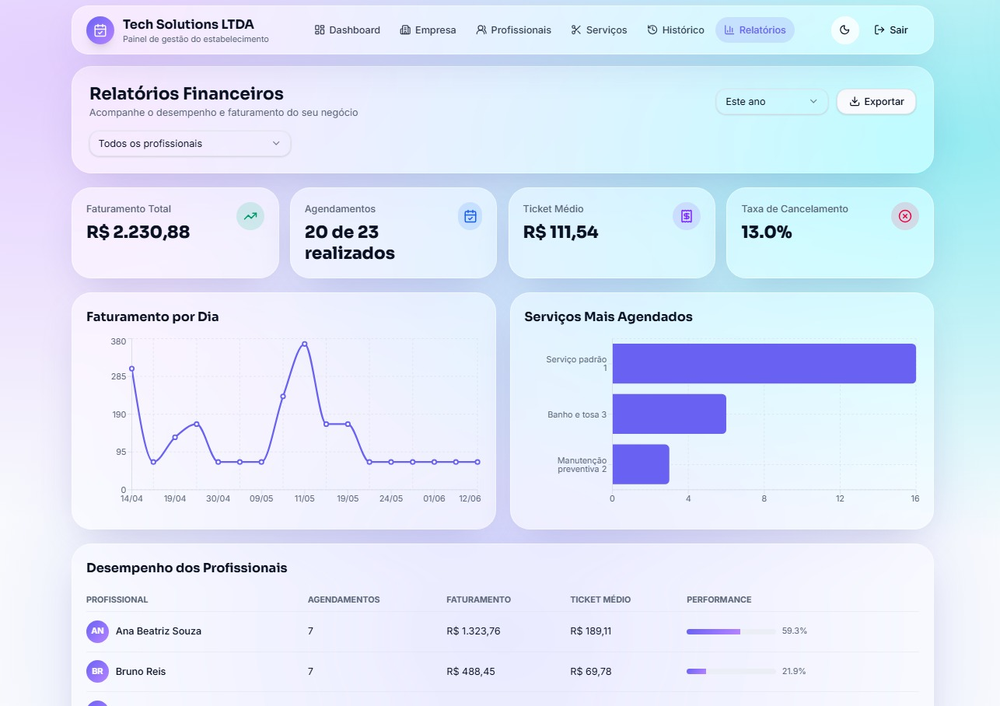

# ClickAgende


Frontend web do ClickAgende, uma plataforma brasileira para agendamento inteligente entre clientes, empresas e profissionais. O projeto entrega uma experiência completa para cadastro, login, descoberta de estabelecimentos, criação e acompanhamento de agendamentos, gestão da empresa, relatórios e avaliações.

Este repositório representa a aplicação Next.js do sistema. Ele conversa com o backend Spring por meio de rotas internas do próprio Next, mantendo a comunicação do navegador mais controlada e centralizando cookies, sessão e regras de acesso no servidor do front.

## Preview

<p align="center">
  
  
</p>
<p align="center">
  
  
</p>

## Funcionalidades

### Cliente

- Cadastro e login de cliente.
- Listagem de estabelecimentos disponíveis.
- Tela de detalhes do estabelecimento com serviços, profissionais e horários.
- Criação de agendamento com validação de disponibilidade.
- Tela "Meus Agendamentos" com próximos, histórico e todos.
- Cancelamento de agendamento permitido conforme regra de negócio.
- Avaliação de atendimento finalizado com nota de 1 a 5 estrelas e comentário opcional.
- Configurações de dados pessoais e preferência de notificação.
- Modal de preferência de notificação exibido na primeira tela após o login, conforme requisito 15.

### Empresa

- Cadastro e login de empresa.
- Dashboard operacional com agenda, calendário e ações de atendimento.
- Cadastro manual de agendamento.
- Gestão dos dados da empresa.
- Gestão de profissionais, incluindo serviços atendidos, jornada e foto.
- Gestão de serviços.
- Histórico paginado de atendimentos com avaliações recebidas.
- Relatórios com KPIs, gráficos e exportação.

### Segurança e sessão

- Cookies HTTP-only para tokens de acesso e refresh.
- Middleware/proxy de proteção por perfil.
- Arquivo central de rotas e permissões em `src/lib/auth/routes.ts`.
- Separação de responsabilidades: navegador -> API Next -> API Spring.
- Bloqueio de acesso a telas públicas quando o usuário já está autenticado no perfil correto.
- Bloqueio de acesso a telas privadas sem sessão válida.

## Stack

- Next.js 16 com App Router.
- React 19.
- TypeScript.
- Tailwind CSS 4.
- React Hook Form e Zod para formulários e validações.
- Radix UI para componentes acessíveis.
- Lucide React para ícones.
- Recharts para gráficos.
- Sonner para notificações.
- ESLint 9 com configuração do Next.

## Estrutura principal

```text
src/
  app/
    api/                    Rotas internas Next que fazem proxy para o Spring
    cliente/                Área do cliente
    empresa/                Área da empresa
  components/
    form/                   Campos reutilizáveis de formulário
    ui/                     Componentes base de UI
    ClientShel.tsx          Header e guarda visual do cliente
    CompanyShell.tsx        Header e guarda visual da empresa
  lib/
    auth/                   Sessão, permissões e proteção de rotas
    server/spring.ts        Cliente server-side para a API Spring
```

## Pré-requisitos

- Node.js 20 ou superior.
- npm.
- Backend ClickAgende rodando em `http://localhost:8080`.

## Variáveis de ambiente

Crie um arquivo `.env.local` com base no `.env.example`:

```env
SPRING_API_URL=http://localhost:8080
SPRING_JWT_SECRET=NzE0ZDA3ZGYtYjA4Yy00ZGQ5LTgxMmQtN2U3YjMyNmI5YjVmCg==
```

`SPRING_JWT_SECRET` deve ser o mesmo segredo configurado no backend para que o front consiga validar a sessão de forma consistente.

## Como executar

```bash
npm install
npm run dev
```

A aplicação fica disponível em:

```text
http://localhost:3000
```

## Scripts

```bash
npm run dev      # Ambiente de desenvolvimento
npm run build    # Build de produção
npm run start    # Executa o build de produção
npm run lint     # Verificação de lint
```

## Contas de teste

As contas são criadas pelo seeder do backend quando o banco está vazio.

| Perfil | E-mail | Senha |
| --- | --- | --- |
| Cliente | `cliente1@teste.com` | `12345678` |
| Empresa | `empresa1@teste.com` | `12345678` |

Também existem contas `cliente2@teste.com` até `cliente8@teste.com` e `empresa2@teste.com` até `empresa8@teste.com`, todas com a mesma senha.

## Rotas principais

### Públicas

- `/`
- `/cliente/login`
- `/cliente/cadastro`
- `/empresa/login`
- `/empresa/cadastro`
- `/termos-de-uso`
- `/politica-de-privacidade`

### Cliente

- `/cliente`
- `/cliente/estabelecimento/[id]`
- `/cliente/agendamentos`
- `/cliente/configuracoes`

### Empresa

- `/empresa`
- `/empresa/dados`
- `/empresa/profissionais`
- `/empresa/servicos`
- `/empresa/historico`
- `/empresa/relatorios`

## Integração com o backend

O navegador não chama a API Spring diretamente. A aplicação utiliza rotas em `src/app/api` para:

- anexar o token da sessão;
- normalizar mensagens de erro;
- transformar payloads quando necessário;
- proteger o segredo e a estrutura real da API;
- manter uma fronteira clara entre UI e backend.

Exemplos:

- `POST /api/auth/login` -> `POST /api/auth/login` no Spring.
- `GET /api/cliente/agenda` -> `GET /agenda/meus-agendamentos`.
- `POST /api/cliente/agenda/[id]/avaliar` -> `POST /agenda/{id}/avaliar`.
- `GET /api/empresa/historico` -> `GET /agenda/painel-gestor`.
- `GET /api/empresa/relatorios` -> `GET /relatorio`.

## Status do projeto

O frontend do ClickAgende está finalizado para a entrega acadêmica atual. As telas principais estão integradas com o backend, possuem validação, controle de acesso por perfil e fluxos completos para cliente e empresa.

Pontos externos, como envio real de notificações por WhatsApp/e-mail, foram deixados preparados em preferência de usuário, mas dependem de provedor externo e configuração posterior de rotina no backend.
